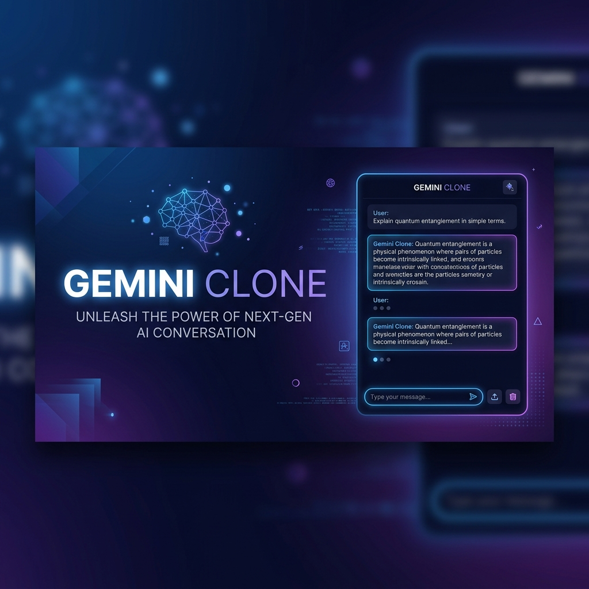

# 🚀 Gemini Clone — Pro AI Assistant



[](https://opensource.org/licenses/MIT)
[](https://reactjs.org/)
[](https://nodejs.org/)
[](https://vitejs.dev/)
[](https://ai.google.dev/)

A state-of-the-art AI chat interface inspired by **Google Gemini**. This project delivers a premium user experience with fluid animations, multi-modal capabilities, and a secure backend architecture.

Developed with precision for high-performance AI interactions.

---

## ✨ Key Features

- **🎨 Premium UI/UX:** A sleek, dark-themed interface built with **Vanilla CSS** and **Framer Motion** for butter-smooth transitions.
- **🎙️ Voice Integration:** Full support for **Speech-to-Text** input and integrated **Text-to-Speech** capabilities.
- **📎 Multi-modal Support:** Seamlessly upload and analyze images and files (up to 5MB) directly in the chat.
- **🧠 Advanced Model Selection:** Switch between different Gemini models (Flash, Pro) on the fly via the built-in selector.
- **📱 True Responsive Design:** Optimized for every screen size, from mobile devices to ultra-wide monitors.
- **🔐 Secure Proxy Backend:** All API requests are proxied through a Node.js server, keeping your **Gemini API Key** safe and hidden from the client browser.
- **📝 Markdown & Code Highlighting:** Rich text rendering with syntax highlighting for code blocks.
- **⚡ Real-time Feedback:** Interactive suggested prompts and loading states to keep the experience engaging.

---

## 🛠️ Tech Stack

### Frontend
- **React (Vite)** — Core framework for speed and modularity.
- **Framer Motion** — Advanced animations and UI transitions.
- **React Markdown** — High-fidelity response rendering.
- **Web Speech API** — Native browser support for voice interactions.

### Backend
- **Node.js & Express** — High-performance secure proxy layer.
- **Google Generative AI SDK** — Deep integration with Gemini for cutting-edge LLM capabilities.
- **Dotenv** — Secure environment variable management.

---

## 📂 Project Structure

```text
gemini-clone/
├── src/                    # React Frontend
│   ├── components/         # Modular UI components (Sidebar, Main, Composer, etc.)
│   ├── context/            # Global state management using Context API
│   ├── assets/             # Brand identity and visual assets
│   ├── api/                # Client-side API abstraction
│   └── App.jsx             # Root application orchestrator
├── server.js               # Node.js Express server (Proxy)
├── gemini.js               # Gemini SDK configuration & logic
├── .env                    # Environment secrets
├── vite.config.js          # Build & Dev configuration
└── package.json            # Dependency manifest
```

---

## ⚙️ Installation & Setup

### 1. Clone & Install
```bash
git clone https://github.com/your-username/gemini-clone.git
cd gemini-clone
npm install
```

### 2. Configuration (`.env`)
Create a `.env` file in the root directory and add your credentials:

```ini
# Gemini API Key from Google AI Studio
GEMINI_API_KEY=your_google_api_key_here

# Backend configuration
PORT=5000

# Frontend configuration
VITE_API_BASE_URL=http://localhost:5000
```

### 3. Run the Development Environment
You'll need to run both the backend server and the frontend development server.

**Terminal 1 (Backend):**
```bash
npm run server
```

**Terminal 2 (Frontend):**
```bash
npm run dev
```

---

## 🔌 API Documentation

### `POST /api/chat`
Proxies user prompts and attachments to the Google Gemini API.

**Request Body:**
```json
{
  "prompt": "Explain the concept of quantum entanglement.",
  "attachments": [
    { "data": "data:image/png;base64,...", "name": "image.png" }
  ]
}
```

---

## 🛡️ Security & Best Practices

- **API Protection:** The server-side proxy prevents your Gemini API key from being exposed in public client-side network logs.
- **Error Handling:** Implemented global catch-alls for network timeouts and API limit exhausts.
- **Validation:** Sanity checks on file sizes (5MB limit) and prompt lengths to ensure stability.

---

## 🎯 Future Roadmap

- [ ] **Streaming Responses:** Real-time character-by-character typing effects.
- [ ] **User Authentication:** Save and sync chat history across multiple devices.
- [ ] **Custom Themes:** User-selectable color palettes (Light, OLED Dark, Modern Blue).
- [ ] **Plug-in System:** Extend capabilities with external tools like Search or Code Interpreter.

---

## 📜 License

Distributed under the MIT License. See `LICENSE` for more information.

**Author:** [Sarvadnya](https://github.com/Sarvadnya07)
