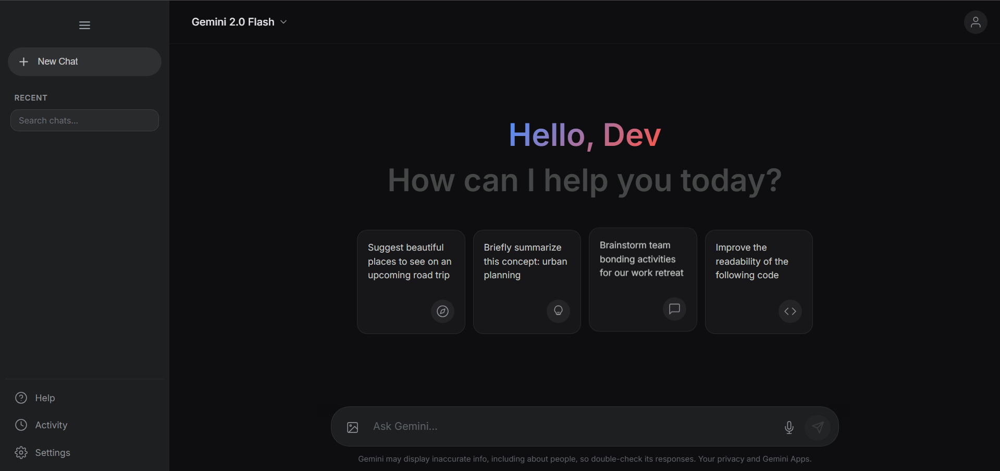
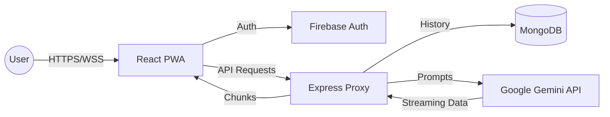

# 🚀 Gemini Pro — Production-Ready AI Assistant Clone



[](https://gemini-clone-mu-lyart.vercel.app/)
[](https://opensource.org/licenses/MIT)
[](https://reactjs.org/)
[](https://nodejs.org/)
[](https://vitejs.dev/)
[](https://www.mongodb.com/)
[](https://firebase.google.com/)

**Gemini Pro** is a high-performance, full-stack AI chat application inspired by Google Gemini. It features real-time streaming, multi-modal capabilities, and a robust security-first architecture. Designed for developers and AI enthusiasts who want a professional-grade starting point for AI-driven interfaces.

---

## ✨ Key Features

### 🧠 Core Intelligence
- **Real-time Streaming:** Experience character-by-character response generation for a fluid, natural conversation feel.
- **Multi-modal Input:** Upload and analyze images (PNG, JPEG, WEBP) directly within the chat interface.
- **Model Selection:** Hot-swap between `Gemini 1.5 Flash` and `Gemini 1.5 Pro` optimized for speed or complexity.

### 🎨 Premium Experience
- **Sleek UI/UX:** Modern dark-themed interface with glassmorphism effects and butter-smooth transitions powered by Framer Motion.
- **Voice Capabilities:** Integrated **Speech-to-Text** for hands-free input and **Text-to-Speech** for audio responses.
- **Code & Markdown:** Rich rendering for technical content, including syntax highlighting for over 20 languages.

### 🔐 Engineering Excellence
- **Secure Proxy Architecture:** Backend-mediated API calls ensure your Google Gemini API keys are never exposed to the client.
- **Cloud Sync:** Persistent chat history synced across devices using MongoDB and Firebase Authentication.
- **PWA Ready:** Installable as a desktop or mobile app with offline-aware capabilities.

---

## 🛠️ Tech Stack

| Layer | Technology |
| :--- | :--- |
| **Frontend** | React 18, Vite, Framer Motion, Context API |
| **Backend** | Node.js, Express.js, Winston (Logging), Helmet |
| **Database** | MongoDB (via Mongoose) |
| **Auth** | Firebase Authentication (Google OAuth) |
| **AI Engine** | Google Generative AI (Gemini SDK) |
| **Styling** | Vanilla CSS (CSS Modules approach) |
| **Testing** | Vitest, React Testing Library |

---

## 🏗️ Architecture



---

## 🚀 Installation Guide

### Prerequisites
- Node.js (v18.0 or higher)
- MongoDB Atlas account (or local MongoDB)
- Firebase Project (for Authentication)
- Google AI Studio API Key

### 1. Clone the Repository
```bash
git clone https://github.com/Sarvadnya07/gemini-clone.git
cd gemini-clone
```

### 2. Environment Setup
Create a `.env` file in the root directory:

```ini
# --- Backend Config ---
PORT=5000
MONGODB_URI=your_mongodb_connection_string
GEMINI_API_KEY=your_google_gemini_api_key
FIREBASE_SERVICE_ACCOUNT_JSON=base64_or_path_to_json

# --- Frontend Config ---
VITE_API_BASE_URL=http://localhost:5000
VITE_FIREBASE_API_KEY=...
VITE_FIREBASE_AUTH_DOMAIN=...
VITE_FIREBASE_PROJECT_ID=...
```

### 3. Install Dependencies
```bash
npm install
```

### 4. Run Development
**Start Backend Server:**
```bash
npm run server
```

**Start Frontend Client:**
```bash
npm run dev
```

---

## 📂 Folder Structure

```text
gemini-clone/
├── middleware/          # Express security & validation layers
├── models/              # Mongoose data schemas (Chat, User)
├── public/              # Static assets & PWA icons
├── src/                 # React Frontend
│   ├── api/             # API client & Axios configuration
│   ├── components/      # UI components (Composer, Sidebar, etc.)
│   ├── context/         # Global State (Context API)
│   ├── utils/           # Frontend helpers (Formatting, Analytics)
│   └── App.jsx          # Root Component
├── utils/               # Backend utility functions (Logger)
├── gemini.js            # Core Gemini SDK implementation
├── server.js            # Express application entry point
└── vite.config.js       # Vite build configuration
```

---

## 🔌 API Documentation

### `POST /api/chat/stream`
The primary endpoint for real-time interaction.

**Payload:**
```json
{
  "prompt": "Write a python script to scrape news.",
  "image": [{ "data": "base64...", "mimeType": "image/png" }],
  "config": { "temperature": 0.7, "model": "gemini-1.5-pro" }
}
```

**Response:**
Returns a `Transfer-Encoding: chunked` stream of plain text.

---

## 🛡️ Security & Performance

- **Rate Limiting:** Protects against API abuse using `express-rate-limit`.
- **Security Headers:** `helmet` is implemented to prevent XSS and clickjacking.
- **Request Validation:** Strict JSON schema validation on all incoming chat prompts.
- **Optimized Assets:** Lazy loading for heavy UI components and image compression logic.

---

## 🤝 Contributing

We welcome contributions! Please follow these steps:
1. Fork the Project
2. Create your Feature Branch (`git checkout -b feature/AmazingFeature`)
3. Commit your Changes (`git commit -m 'Add some AmazingFeature'`)
4. Push to the Branch (`git push origin feature/AmazingFeature`)
5. Open a Pull Request

---

## 📜 License

Distributed under the MIT License. See `LICENSE` for more information.

---

## 👥 Authors

- **Sarvadnya** - *Lead Developer* - [@Sarvadnya07](https://github.com/Sarvadnya07)

---

> [!TIP]
> Use the **Settings** panel within the app to adjust model temperature and system instructions for more creative or precise outputs.
